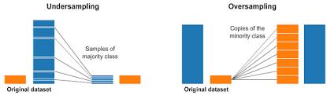
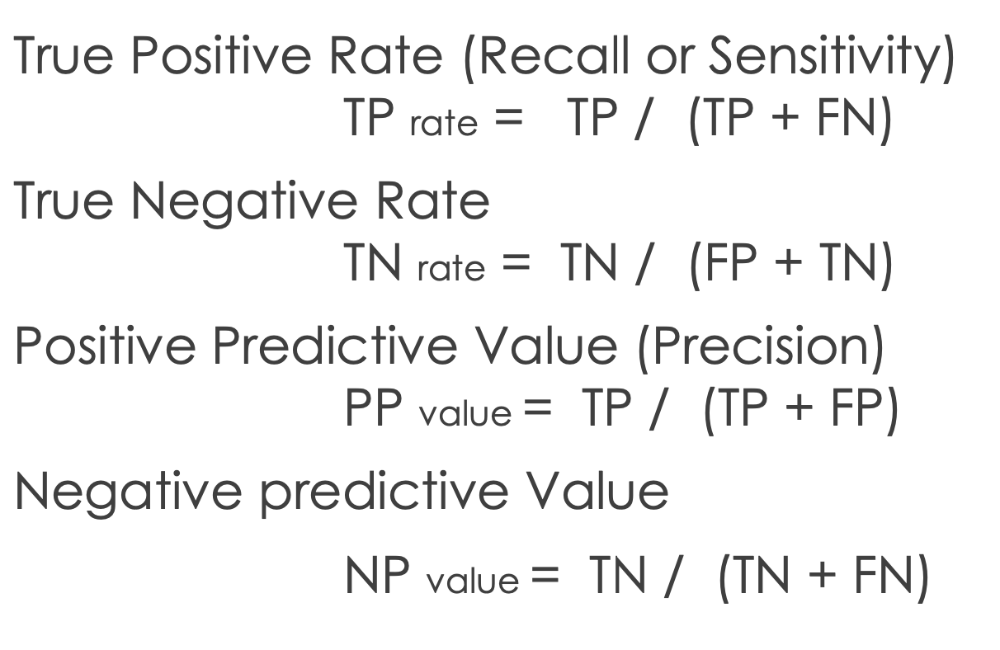
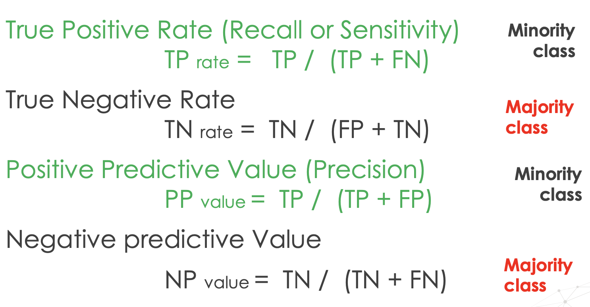
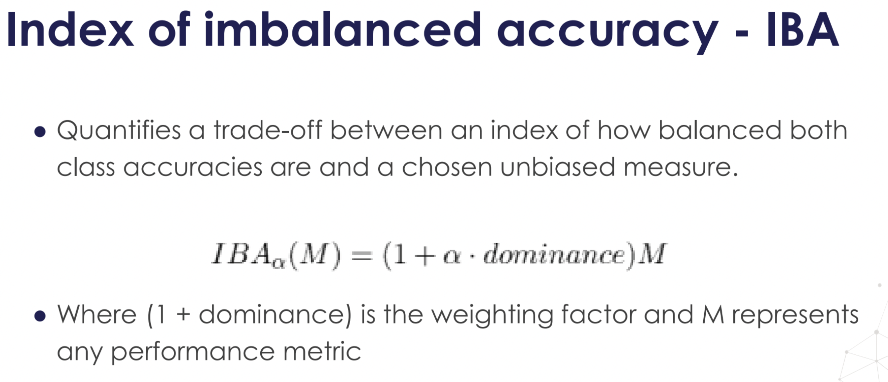
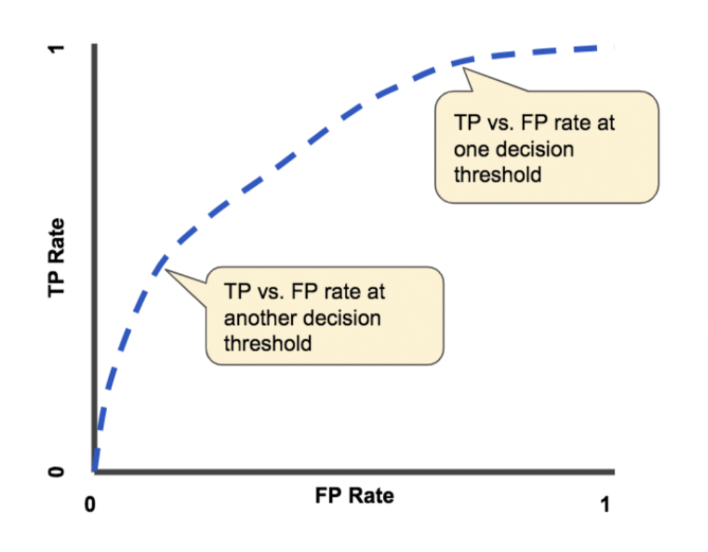

# Machine-Learning-with-Imbalanced-Dataset-Udemy
Multiple techniques which you can use with imbalanced datasets to improve the performance of your machine learning models.

If you are working with imbalanced datasets right now and want to improve the performance of your models, or you simply want to learn more about how to tackle data imbalance, this course will show you how.

step-by-step through engaging video tutorials and teach everything you need to know about working with imbalanced datasets. Throughout this comprehensive course, cover almost every available methodology to work with imbalanced datasets, discussing their logic, their implementation in Python, their advantages and shortcomings, and the considerations to have when using the technique. Specifically, you will learn:

1. Under-sampling methods at random or focused on highlighting certain sample populations

2. Over-sampling methods at random and those which create new examples based of existing observations

3. Ensemble methods that leverage the power of multiple weak learners in conjunction with sampling techniques to boost model performance

4. Cost sensitive methods which penalize wrong decisions more severely for minority classes

5. The appropriate metrics to evaluate model performance on imbalanced datasets

